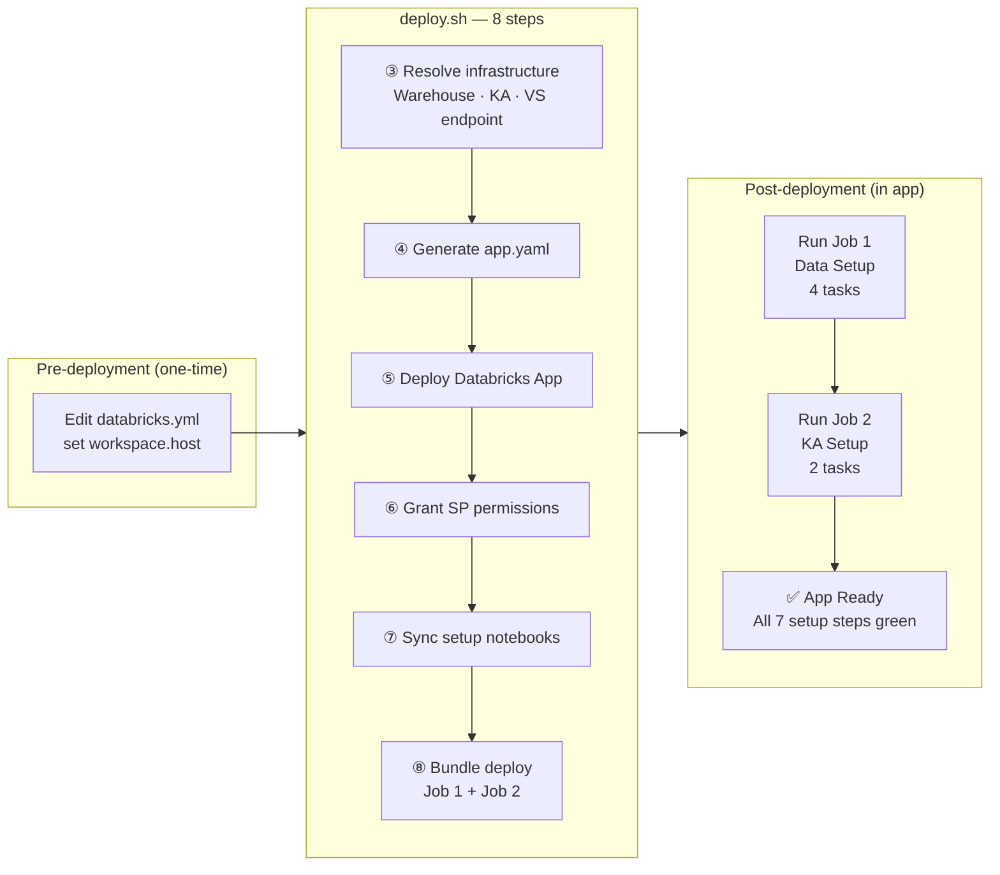
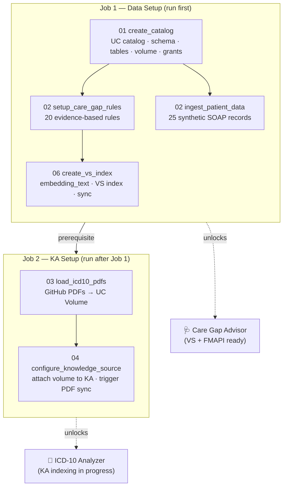

# Installation Guide

This guide walks through every stage of deploying and configuring the ICD-10 Gap Analysis Demo,
from running `deploy.sh` through having a fully operational app.

---

## Deployment Overview



---

---

## Pre-Installation — Configuration Values to Update

Only **one file** needs editing before deployment: `databricks.yml`. Everything else —
`app.yaml`, SQL warehouse, KA endpoint — is resolved and generated automatically at deploy time.

---

### `databricks.yml`

This is the single source of truth for all configuration. Update the values below before
running `deploy.sh`:

#### Required

| Variable | Location | What to set |
|----------|----------|-------------|
| `workspace.host` | `targets.dev.workspace.host` | Your Databricks workspace URL |

```yaml
targets:
  dev:
    mode: development
    workspace:
      host: https://adb-1234567890.12.azuredatabricks.net   # ← your workspace URL
```

#### Optional overrides (have working defaults)

| Variable | Default | When to change |
|----------|---------|----------------|
| `catalog` | `my_catalog` | If your catalog has a different name |
| `schema` | `icd10_care_gap` | If you want a different schema name |
| `warehouse_id` | `""` (auto-created) | Set to an existing warehouse ID to skip auto-creation |
| `ka_display_name` | `ICD-10 Clinical Reference Assistant` | Change if you want a different KA name |
| `vs_endpoint_name` | `rag_pdf_vs_endpoint` | VS endpoint for care gap rule retrieval. Use an existing ONLINE endpoint or provide a new name — `setup_resources.py` creates it if it doesn't exist |

> **`app.yaml` — do not edit.** It is overwritten by `deploy.sh` at every deploy. All
> environment variables are injected from resolved values at deploy time.

---

### Pre-Installation Checklist

- [ ] `databricks.yml` — `workspace.host` updated to your workspace URL
- [ ] Databricks CLI authenticated: `databricks auth profiles` shows a valid profile
- [ ] Terraform installed: `terraform -version` returns a version

---

## Stage 1 — Deployment (`deploy.sh`)

**Trigger:** Run `./deploy.sh` from the project root.

```bash
chmod +x deploy.sh
./deploy.sh --profile DEFAULT
```

All flags are optional — defaults are read from `databricks.yml`. The workspace app path is derived automatically from the bundle configuration.

| Flag | Default (from `databricks.yml`) | Description |
|------|---------------------------------|-------------|
| `--profile` | `DEFAULT` | Databricks CLI profile |
| `--catalog` | `my_catalog` | Unity Catalog name |
| `--schema` | `icd10_care_gap` | Schema name |
| `--warehouse-id` | `""` (auto-created) | SQL Warehouse ID |
| `--ka-display-name` | `ICD-10 Clinical Reference Assistant` | KA display name |

### What deploy.sh does — step by step

#### Step 1 — Read defaults from `databricks.yml`

All variable defaults are parsed from `databricks.yml`. Command-line flags override them.

#### Step 2 — Derive workspace app path

Runs `databricks bundle validate` against the local `databricks.yml` to read `workspace.file_path`, then appends `/app`. No manual path flag needed.

#### Step 3 — Resolve SQL warehouse, KA endpoint, VS endpoint (`setup_resources.py`)

| Resource | Condition | Action |
|----------|-----------|--------|
| SQL Warehouse | `warehouse_id` set and valid | Uses it |
| SQL Warehouse | Empty or invalid | Creates a new serverless warehouse |
| KA endpoint | KA with matching `display_name` found | Reads `endpoint_name` — no creation needed |
| KA endpoint | Not found | Creates a new KA, waits for `READY` state |
| VS endpoint | `vs_endpoint_name` exists and is ONLINE | Uses it |
| VS endpoint | Not found | Creates it, waits for ONLINE state (~30s) |

> The VS index name (`<catalog>.<schema>.care_gap_rules_vs_index`) is derived at runtime from the catalog and schema env vars — it is never stored as a separate variable. The index itself is created by Job 1, not here.

#### Step 4 — Generate `app.yaml`

Writes a fresh `app.yaml` with all resolved values and uploads it to the workspace path.
Current generated format:

```yaml
command: ["python", "app.py"]

env:
  - name: UC_CATALOG
    value: "<resolved catalog>"
  - name: UC_SCHEMA
    value: "<resolved schema>"
  - name: DATABRICKS_WAREHOUSE_ID
    value: "<resolved warehouse_id>"
  - name: FMAPI_ENDPOINT
    value: "databricks-claude-sonnet-4-6"
  - name: KA_ENDPOINT_NAME
    value: "<resolved ka_endpoint_name>"
  - name: KA_NAME
    value: "<resolved ka_name>"
  - name: DATA_SETUP_JOB_NAME
    value: "<resolved data_setup_job_name>"
  - name: AI_SETUP_JOB_NAME
    value: "<resolved ai_setup_job_name>"
  - name: VS_ENDPOINT_NAME
    value: "<resolved vs_endpoint_name>"

resources:
  - name: sql-warehouse
    sql_warehouse:
      id: "<resolved warehouse_id>"
      permission: "CAN_USE"
```

`VS_INDEX_NAME` is set to the deterministic index path. The app reads this at startup and
uses it for every Care Gap VS query. The index itself is created by Job 1, Task 4 — not here.

#### Step 5 — Deploy the Databricks App

Creates or updates `icd10-gap-advisor` and provisions its dedicated service principal.

#### Step 6 — Grant permissions to app service principal

| Permission | Resource | How granted |
|-----------|----------|-------------|
| `CAN_USE` | SQL Warehouse | `deploy.sh` Step 6 |
| `CAN_QUERY` | KA serving endpoint | `deploy.sh` Step 6 |
| `CAN_QUERY` | KA resource | `deploy.sh` Step 6 |
| `MODIFY` | `bootstrap_status` table | `01_create_catalog` notebook |
| `CAN_QUERY` | VS endpoint | `06_create_care_gap_vs_index` notebook (Job 1, Task 4) |

> VS endpoint permissions are granted by Job 1 Task 4 because the app SP must exist
> (created in Step 5) before it can be granted permissions on existing infrastructure.

#### Step 7 — Deploy the Asset Bundle (Jobs)

Creates **Job 1 (Data Setup)** and **Job 2 (AI Setup)** as Databricks Workflow Jobs.

### Resources created after Stage 1

| Resource | Type | Notes |
|----------|------|-------|
| Databricks App | App | `icd10-gap-advisor` |
| App Service Principal | IAM | Auto-created by the app |
| SQL Warehouse | SQL | Auto-created if not pre-existing |
| KA Serving Endpoint | Model Serving | Looked up or auto-created |
| Job 1: Data Setup | Workflow Job | Includes VS index task |
| Job 2: AI Setup | Workflow Job | ICD-10 PDF indexing |
| VS index | **Not yet** | Created by Job 1, Task 4 |

---

## Stage 2 — App First Launch

**Trigger:** Open the app URL from the Databricks Apps UI.

### What you see

- **Home tab** — Patient accordion (empty until Job 1 completes).
- **ICD-10 Analyzer** — Requires patients loaded (Job 1, Tasks 1–3).
- **Care Gap Advisor** — Requires patients + VS index (Job 1, Tasks 1–4).
- **Setup page** — Configuration + Job 1 / Job 2 trigger buttons. All **7 steps** show **Not Started**.

---

## Stage 3 — Setup Page

Navigate to **Setup** via the ⚙ icon in the navbar.

Three-column layout:
- **Configuration** — Read-only env vars from `app.yaml` (catalog, schema, endpoints, VS index name).
- **Job 1 — Data Setup** — Steps 1–4: catalog, rules, patients, VS index. Prerequisites: SQL Warehouse + VS Endpoint.
- **Job 2 — KA Setup** — Steps 5–7: ICD-10 PDFs, KA source attachment, sync status. Prerequisite: KA Endpoint.

---

## Setup Jobs Overview



> Job 1 and Job 2 are independent workflows — Job 2 can start as soon as Job 1 completes.
> The Care Gap Advisor is fully operational after Job 1. ICD-10 PDF citations improve
> progressively as the Knowledge Assistant indexes PDFs (20–60 min asynchronously).

---

## Stage 4 — Job 1: Data Setup

**Trigger:** Click **Run Data Setup (Job 1)** on the Setup page.

Job 1 runs `create_catalog` first, then **four** parallel tasks on serverless compute.

### Tasks

#### Task 1: `create_catalog` (runs first, all others depend on it)

Notebook: `setup/01_create_catalog.py`

| Resource created | Notes |
|-----------------|-------|
| UC Catalog | Skipped if exists |
| Schema | `<catalog>.<schema>` |
| `patient_records` | Delta table |
| `care_gap_rules` | Delta table — CDF enabled by Task 4 |
| `icd10_analysis_results` | Delta table |
| `care_gap_findings` | Delta table |
| `bootstrap_status` | Delta table — setup state tracker |
| `icd10_reference_pdfs` | UC Volume |
| App SP grants | SELECT on all tables, MODIFY on `care_gap_findings` and `bootstrap_status` |

#### Tasks 2–4 (parallel, after `create_catalog`)

| Task | Notebook | What it does |
|------|----------|--------------|
| `setup_care_gap_rules` | `setup/02_setup_care_gap_rules.py` | Seeds `care_gap_rules` with 20 evidence-based rules |
| `ingest_patient_data` | `setup/02_ingest_patient_json.py` | Writes 25 synthetic SOAP patient records |
| `create_vs_index` | `setup/06_create_care_gap_vs_index.py` | **Creates VS index for Care Gap Advisor** (depends on `setup_care_gap_rules`) |

> `create_vs_index` depends on `setup_care_gap_rules` completing first (the rules table must be populated before it can be indexed). It runs in parallel with `ingest_patient_data`.

---

### Task 4 deep-dive: `create_vs_index`

This task sets up the entire semantic retrieval stack for the Care Gap Advisor.
It uses the VS endpoint resolved by `setup_resources.py` in Step 3 — either an existing
endpoint or a newly created one, depending on whether `vs_endpoint_name` was found.

#### Step-by-step

**1. Enable Change Data Feed on `care_gap_rules`**

```sql
ALTER TABLE care_gap_rules
SET TBLPROPERTIES ('delta.enableChangeDataFeed' = 'true')
```

Required by Delta Sync — CDF lets the VS pipeline propagate inserts, updates, and deletes
to the index automatically on each triggered sync.

**2. Populate `embedding_text` column**

Adds and populates an `embedding_text` column with clinically rich descriptions:

| Rule | Raw `check_description` | Generated `embedding_text` |
|------|-------------------------|---------------------------|
| CGR-001 | "HbA1c measured within the last 12 months" | "Annual HbA1c for Type 2 Diabetes Mellitus. HbA1c measured within the last 12 months. Guideline: ADA Standards of Care 2024. Priority: HIGH." |
| CGR-006 | "Check BP is below 130/80 mmHg" | "BP at Target (<130/80) for Hypertension. Check BP is below 130/80 mmHg. Guideline: ACC/AHA 2023. Priority: HIGH." |

Condition codes are expanded to full medical names (T2DM → Type 2 Diabetes Mellitus,
HTN → Hypertension, etc.) to improve semantic matching across clinical terminology variants.

**3. Create Delta Sync index**

| Property | Value |
|----------|-------|
| Index name | `<catalog>.<schema>.care_gap_rules_vs_index` |
| VS endpoint | value of `vs_endpoint_name` (resolved/created by `setup_resources.py`) |
| Primary key | `rule_id` |
| Embedding column | `embedding_text` |
| Embedding model | `databricks-gte-large-en` |
| Pipeline type | `TRIGGERED` — sync runs on demand, not continuously |

**4. Wait for initial sync**

Embeds all 20 rules (~30–60 seconds). Task waits for the index to reach `READY` state.

**5. Grant app SP `CAN_QUERY` on VS endpoint**

The app must be deployed (Stage 1, Step 4) before this grant can run, which is why
VS permissions are handled here rather than in `deploy.sh`.

**6. Write `care_gap_vs_index → COMPLETED` to `bootstrap_status`**

The Setup page reads this on next refresh to show the step as complete.

### VS index state at end of Job 1

| Component | State |
|-----------|-------|
| `care_gap_rules.embedding_text` | Populated for all 20 rules |
| `care_gap_rules` CDF | Enabled |
| `care_gap_rules_vs_index` | READY — 20 rules embedded, queries served |
| `bootstrap_status.care_gap_vs_index` | COMPLETED |
| **Setup page step 4** | **Green — "Care Gap VS Index Ready"** |
| App | Care Gap Advisor using VS retrieval automatically |

---

## Stage 5 — Job 2: AI Setup

**Trigger:** Click **Run AI Setup (Job 2)** on the Setup page after Job 1 completes.

> Job 2 does **not** touch the VS index. Care gap VS retrieval is fully operational after
> Job 1. Job 2 is only required for ICD-10 PDF analysis.

### Tasks

#### `configure_knowledge_source`

Notebook: `setup/04_configure_knowledge_source.py`

| Step | What happens |
|------|-------------|
| Locate KA | Finds KA by `KA_ENDPOINT_NAME` |
| Attach volume | `POST /api/2.1/<ka-name>/knowledge-sources` with `icd10_reference_pdfs` volume |
| **Reset VS sync cache** | Deletes `ka_source_sync` row from `bootstrap_status` so app re-polls on next refresh |
| Write status | `ka_source_configured → COMPLETED` |

> Re-running Job 2 resets the KA sync cache (`ka_source_sync`) so the app re-checks
> PDF indexing status. The VS index for care gap rules is unaffected.

### After Job 2 completes

Setup page steps 4–6 show **Completed**. PDF indexing runs asynchronously (20–60 min).
Step 6 (`ka_source_sync`) updates on each Setup page refresh until UPDATED.

---

## Stage 6 — ICD-10 Analyzer

**Prerequisites:** Job 1 (patients loaded) + Job 2 (KA volume configured).

### Workflow

1. Select patient → SOAP note loads.
2. Click **Analyze ICD-10 Codes**.
3. App calls `FMAPI_ENDPOINT` (Claude Sonnet) with the clinical note.
4. Model returns ICD-10 code suggestions with confidence levels.
5. Save codes to `icd10_analysis_results`.

---

## Stage 7 — Care Gap Advisor

**Prerequisite:** Job 1 only. Does not require ICD-10 Analyzer or Job 2.

### Workflow

1. Select patient → dropdown populated from `patient_records`.
2. Click **Identify Care Gaps**.
3. App runs the VS retrieval + AI analysis pipeline:

```
Clinical note (first 3,000 chars)
    │
    ▼
POST /api/2.0/vector-search/indexes/{VS_INDEX_NAME}/query
  query_text: clinical note
  num_results: 15
  embedding model: databricks-gte-large-en (server-side)
    │
    ▼
Top-15 semantically relevant rules retrieved (~200ms)
    │
    ▼
Claude Sonnet FMAPI (max_tokens=2000)
  System: clinical care gap analyzer instructions
  User: patient note + 15 retrieved rules
    │
    ▼
Applicable gaps: rule_id, gap_name, priority, finding, recommended_action, guideline
    │
    ▼
Saved to care_gap_findings on user click
```

### Why VS retrieval works without ICD-10 codes

The query uses raw clinical note text, not ICD-10 codes. A note containing
`"metformin 1000mg BID, HbA1c 9.2%, no recent ophthalmology visit"` semantically
matches T2DM care gap rules (HbA1c monitoring, diabetic eye exam) through vector
similarity — even if no E11.x codes appear in the note.

This means patients with no saved ICD-10 codes get exactly the same retrieval quality
as patients who have had the ICD-10 Analyzer run.

### Adding or updating care gap rules

Rules live in the `care_gap_rules` Delta table. No code changes or app redeployment needed:

```sql
-- Add a new rule
INSERT INTO my_catalog.icd10_care_gap.care_gap_rules
VALUES ('CGR-021', 'T2DM', 'Statin Therapy', 'ADA 2024',
        'Statin prescribed for T2DM patients aged 40–75', 'HIGH', NULL);

-- Edit an existing rule
UPDATE my_catalog.icd10_care_gap.care_gap_rules
SET check_description = 'Updated check criteria'
WHERE rule_id = 'CGR-001';
```

**After any rule change, regenerate `embedding_text` and sync the VS index:**

```bash
# Trigger a sync via the VS API (fastest — ~1 min for < 100 rules)
databricks api post /api/2.0/vector-search/indexes/my_catalog.icd10_care_gap.care_gap_rules_vs_index/sync --profile DEFAULT
```

Or re-run Job 1, which detects the existing index and triggers a sync automatically.

---

## VS Index Lifecycle Reference

| Event | Index state | Setup page | Action required |
|-------|-------------|-----------|-----------------|
| Before Job 1 | Does not exist | Step 4: Not Started | Run Job 1 |
| Job 1 `create_vs_index` running | Being created + syncing | Step 4: In Progress | Wait |
| Job 1 complete | READY — all rules embedded | Step 4: Completed ✓ | None |
| Rules added/edited in SQL | Stale — new rules not embedded | Step 4: still green | Trigger sync |
| Job 1 re-run | Detects existing index → sync only | Step 4: re-runs, stays green | None |
| Job 2 run or re-run | Unchanged | Unaffected | None |
| VS endpoint OFFLINE | Queries fail silently | Job 1 prereq: red | Wait or check endpoint |
| VS endpoint recovers | Queries resume automatically | Job 1 prereq: green | None |

### Scaling guide

| Rule count | VS retrieves | Latency overhead | Benefit |
|-----------|-------------|-----------------|---------|
| 20 (current) | top-15 | ~250ms | ~25% fewer rules per query |
| 100 | top-15 | ~250ms | ~85% fewer rules — significant |
| 1,000 | top-15 | ~250ms | ~98.5% fewer rules — dramatic |
| 10,000+ | top-15 | ~300ms | O(1) — fully scalable |

Tune `_VS_NUM_RESULTS` in `tab_caregap.py` to adjust retrieval width. Higher values
improve recall; lower values reduce Sonnet prompt size.

---

## Troubleshooting

| Symptom | Likely cause | Fix |
|---------|-------------|-----|
| Setup page: all steps "Not Started" | Job 1 hasn't run | Click Run Data Setup (Job 1) |
| Care Gap Advisor falls back to all rules | VS index not ready or `VS_INDEX_NAME` not set | Ensure Job 1 completed; check Settings tab for `VS_INDEX_NAME` |
| New rules not appearing in care gap results | VS index not synced after rule insert | Trigger sync via API or re-run Job 1 |
| Job 1 `create_vs_index` fails: "not a valid VS source" | CDF not enabled | Re-run Job 1 — task enables CDF before creating index |
| Job 1 prereq shows VS Endpoint red | VS endpoint OFFLINE or `VS_ENDPOINT_NAME` not set | Verify endpoint is ONLINE; re-run `deploy.sh` if `VS_ENDPOINT_NAME` is missing from `app.yaml` |
| Job 1 `create_vs_index` fails: endpoint not found | `vs_endpoint_name` in `databricks.yml` is wrong or endpoint offline | Verify endpoint: `databricks api get /api/2.0/vector-search/endpoints` |
| VS query returns unexpected rules | `embedding_text` column is stale | Re-run Job 1 to regenerate embeddings |
| ICD-10 Analyzer disabled | No patients loaded | Run Job 1 |
| ICD-10 Analyzer returns no results | PDF indexing in progress | Wait 20–60 min; refresh Setup page |
| Job 2 fails: "No KA found" | `KA_ENDPOINT_NAME` env var mismatch | Re-run `deploy.sh` to re-resolve and regenerate `app.yaml` |
| "SQL Warehouse permission denied" | App SP missing `CAN_USE` | Re-run `deploy.sh` — Step 5 grants the permission |

---

## Re-running Jobs

All setup notebooks are idempotent — safe to re-run at any time:

- **Job 1 re-run:** syncs the VS index with any rule changes; does not duplicate data.
- **Job 2 re-run:** resets KA PDF sync cache; re-attaches volume if detached. Does not
  affect VS index.
- Re-running either job does not duplicate tables, indexes, or resources.
