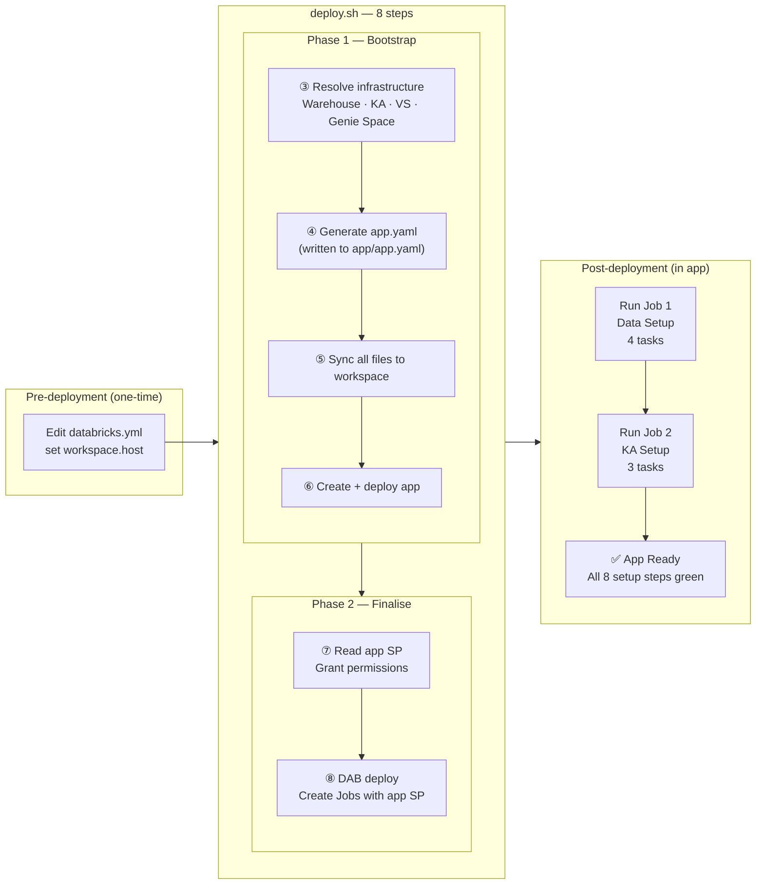
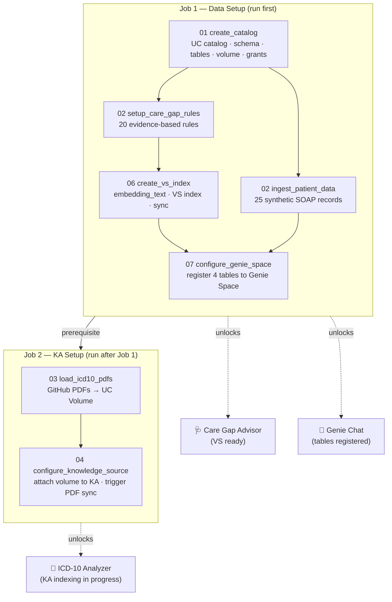

# Installation Guide

This guide walks through every stage of deploying and using the ICD-10 Gap Analysis Demo,
from editing `databricks.yml` through having a fully operational app with Genie chat.

---

## Deployment Overview



---

## Pre-Installation — Configuration Values

Only **one file** needs editing before deployment: `databricks.yml`.

### Required

| Variable | Location | What to set |
|----------|----------|-------------|
| `workspace.host` | `targets.dev.workspace.host` | Your Databricks workspace URL |

```yaml
targets:
  dev:
    mode: development
    workspace:
      host: https://adb-1234567890.12.azuredatabricks.net   # ← your workspace URL
```

### Optional overrides (all have working defaults)

| Variable | Default | When to change |
|----------|---------|----------------|
| `catalog` | `my_catalog` | Your catalog name |
| `schema` | `icd10_care_gap` | Schema name for all tables |
| `warehouse_name` | `icd10-gap-demo-warehouse` | Warehouse looked up by name — auto-created if not found |
| `ka_display_name` | `ICD-10 Clinical Reference Assistant` | KA display name — looked up or auto-created |
| `vs_endpoint_name` | `rag_pdf_vs_endpoint` | VS endpoint — looked up or auto-created |
| `genie_space_name` | `icd10-gap-genie` | Genie Space title — looked up or auto-created |
| `app_name` | `icd10-gap-advisor` | Databricks App name — change for parallel deployments |

> **`app.yaml` — do not edit.** Generated by `deploy.sh` (Step 4) with all resolved values
> and synced to the workspace in Step 5. Gitignored because it contains environment-specific IDs.

### Pre-Installation Checklist

- [ ] `databricks.yml` — `workspace.host` updated
- [ ] Databricks CLI authenticated: `databricks auth profiles` shows a valid profile
- [ ] Terraform installed: `terraform -version` returns a version

---

## Permissions Reference

All permissions are granted automatically — nothing needs to be set manually.
This section documents what is granted, by whom, and when.

### Deploying user (you)

| Privilege | Object | Why |
|-----------|--------|-----|
| `CREATE CATALOG` | Workspace | Required to create the Unity Catalog (skipped if catalog already exists) |
| Databricks CLI authenticated | Workspace | `deploy.sh` uses the CLI for all API calls |
| Terraform installed | Local machine | Required by `databricks bundle deploy` |

---

### App Service Principal — Unity Catalog (granted by Job 1, Task 1)

`01_create_catalog.py` runs `GRANT` statements for the app SP immediately after creating the schema.

| Privilege | Object | Used for |
|-----------|--------|----------|
| `USAGE` | Catalog | Access the catalog |
| `USAGE` | Schema | Access the schema |
| `SELECT` | `patient_records` | Load patient list and SOAP notes |
| `SELECT` | `care_gap_rules` | Load rules for Care Gap Advisor |
| `SELECT` | `icd10_analysis_results` | Read saved ICD-10 codes |
| `MODIFY` | `icd10_analysis_results` | Save ICD-10 analysis results |
| `SELECT` | `care_gap_findings` | Read saved care gap findings |
| `MODIFY` | `care_gap_findings` | Save care gap findings |
| `SELECT` | `bootstrap_status` | Read setup progress on Setup page |
| `MODIFY` | `bootstrap_status` | Write setup step completion status |
| `READ VOLUME` | `icd10_reference_pdfs` | Read uploaded ICD-10 PDFs |

---

### App Service Principal — Infrastructure (granted by `deploy.sh` Step 7)

Granted immediately after the app is deployed and the SP is provisioned.

| Permission | Object | Granted by |
|-----------|--------|------------|
| `CAN_USE` | SQL Warehouse | `databricks permissions update warehouses` |
| `CAN_QUERY` | KA Serving Endpoint | `databricks permissions update serving-endpoints` |
| `CAN_QUERY` | KA Resource | `databricks permissions update knowledge-assistants` |
| `CAN_USE` | VS Endpoint | `databricks api patch permissions/vector-search-endpoints` |
| `CAN_RUN` | Genie Space | `databricks permissions update genie` |
| `CAN_MANAGE_RUN` | Job 1 (Data Setup) | DAB deploy #2 via `workflows.yml` permissions block |
| `CAN_MANAGE_RUN` | Job 2 (KA Setup) | DAB deploy #2 via `workflows.yml` permissions block |

---

### App Service Principal — Additional (granted by Job 1, Task 4)

`06_create_care_gap_vs_index.py` grants VS endpoint query access after the index is created.

| Permission | Object | Granted by |
|-----------|--------|------------|
| `CAN_QUERY` | VS Endpoint | Notebook `06_create_care_gap_vs_index.py` (Task 4) |

---

### App Service Principal — Genie Space tables (granted by Job 1, Task 5)

`07_configure_genie_space.py` registers the 4 Delta tables and re-confirms the space permission.

| Permission | Object | Granted by |
|-----------|--------|------------|
| `CAN_RUN` | Genie Space | Notebook `07_configure_genie_space.py` (Task 5) |

> **Note:** If saving ICD-10 codes fails with `PERMISSION_DENIED`, re-run Job 1 — Task 1 grants `MODIFY` on `icd10_analysis_results`. This permission is only applied when Job 1 runs for the first time on a new schema.

---

## Stage 1 — Deployment (`deploy.sh`)

```bash
chmod +x deploy.sh
./deploy.sh --profile DEFAULT
```

All flags are optional — defaults are read from `databricks.yml`.

| Flag | Default | Description |
|------|---------------------------------|-------------|
| `--profile` | `DEFAULT` | Databricks CLI profile |
| `--catalog` | from `databricks.yml` | Unity Catalog name |
| `--schema` | from `databricks.yml` | Schema name |
| `--warehouse-name` | from `databricks.yml` | SQL Warehouse name |
| `--ka-display-name` | from `databricks.yml` | KA display name |
| `--genie-space-name` | from `databricks.yml` | Genie Space title |

### What deploy.sh does — step by step

#### Step 1 — Read defaults from `databricks.yml`

Parses all variable defaults. Command-line flags override them.

#### Step 2 — Derive workspace path

Runs `databricks bundle validate` to resolve `workspace.file_path` (the DAB bundle default
path for the current user/target). Used as the sync destination.

#### Step 3 — Resolve infrastructure (`setup_resources.py`)

| Resource | Condition | Action |
|----------|-----------|--------|
| SQL Warehouse | `warehouse_name` found in workspace | Reuse — returns ID |
| SQL Warehouse | Not found | Creates serverless warehouse with that name |
| KA endpoint | KA with matching `display_name` found | Reuses endpoint |
| KA endpoint | Not found | Creates KA, waits for `READY` |
| VS endpoint | `vs_endpoint_name` found and ONLINE | Uses it |
| VS endpoint | Not found | Creates it, waits for ONLINE (~2 min) |
| Genie Space | Space with matching `title` found | Reuses space ID |
| Genie Space | Not found | Creates space with title + description |

> The VS index and Genie Space table registration are NOT done here — both are handled
> by Job 1 after the tables exist.

#### Step 4 — Generate `app.yaml`

Writes `app/app.yaml` locally with all resolved values (warehouse ID, KA endpoint,
VS endpoint name, Genie Space ID). Picked up and synced to workspace in Step 5.

```yaml
command: ["python", "app.py"]
env:
  - name: UC_CATALOG
  - name: UC_SCHEMA
  - name: DATABRICKS_WAREHOUSE_ID
  - name: FMAPI_ENDPOINT
  - name: KA_ENDPOINT_NAME
  - name: KA_NAME
  - name: VS_ENDPOINT_NAME
  - name: GENIE_SPACE_ID          # ← new
  - name: DATA_SETUP_JOB_NAME
  - name: AI_SETUP_JOB_NAME
resources:
  - name: sql-warehouse
    sql_warehouse:
      id: "<resolved warehouse_id>"
      permission: "CAN_USE"
```

#### Step 5 — Sync all files to workspace

`databricks sync --full` pushes the entire local git clone to the workspace bundle path.
This includes `app/`, `setup/`, `resources/`, `deploy.sh`, and `setup_resources.py`.
No jobs are created at this step — files only.

> Git is the single source of truth. The workspace is a deployment target only.

#### Step 6 — Create + deploy the Databricks App

Creates `icd10-gap-advisor` (if new), waits for compute to be ACTIVE, then deploys a
SNAPSHOT from the workspace path synced in Step 5.

#### Step 7 — Grant permissions to app service principal

| Permission | Resource |
|-----------|----------|
| `CAN_USE` | SQL Warehouse |
| `CAN_QUERY` | KA serving endpoint |
| `CAN_QUERY` | KA resource |
| `CAN_USE` | VS endpoint |
| `CAN_MANAGE_RUN` | Job 1 + Job 2 (via DAB deploy #2) |
| `MODIFY` | `bootstrap_status` table (by `01_create_catalog` notebook) |

#### Step 8 — DAB deploy (create Jobs with app SP)

Runs `databricks bundle deploy` which creates/updates Job 1 and Job 2 with the
`app_service_principal` var set — jobs get `CAN_MANAGE_RUN` for the app SP.
File sync is minimal (files already synced in Step 5).

Job names include the DAB development mode prefix:
```
[dev <username>] ICD-10 Gap — Data Setup
[dev <username>] ICD-10 Gap — KA Setup
```

### Resources created after Stage 1

| Resource | Type | Notes |
|----------|------|-------|
| Databricks App | App | `<app_name>` |
| App Service Principal | IAM | Auto-created by the app in Step 6 |
| SQL Warehouse | SQL | Looked up by name or auto-created (Step 3) |
| KA Serving Endpoint | Model Serving | Looked up or auto-created (Step 3) |
| Genie Space | AI/BI Genie | Looked up or auto-created (Step 3) |
| Job 1: Data Setup | Workflow Job | 4 tasks — created Step 8, SP permissions set Step 8 |
| Job 2: AI Setup | Workflow Job | 3 tasks — created Step 8, SP permissions set Step 8 |
| VS index | **Not yet** | Created by Job 1 Task 4 |
| Genie tables | **Not yet** | Registered by Job 1 Task 5 |

---

## Stage 2 — App First Launch

Open the app URL printed at the end of `deploy.sh`.

- **Home tab** — patient accordion (empty until Job 1 completes)
- **ICD-10 Analyzer** — requires patients (Job 1 Tasks 1–3)
- **Care Gap Advisor** — requires patients + VS index (Job 1 Tasks 1–4)
- **💬 Genie Chat** — floating panel, shows "Setup required" until Job 1 Task 5 completes
- **Setup page** — all **8 steps** show **Not Started**

---

## Stage 3 — Setup Page

Navigate to **Setup** via the ⚙ icon in the navbar.

Three-column layout:
- **Configuration** — read-only env vars from `app.yaml`
- **Job 1 — Data Setup** — Steps 1–5
- **Job 2 — KA Setup** — Steps 6–8

---

## Setup Jobs Overview



> Job 1 and Job 2 are independent — Job 2 can start as soon as Job 1 completes.

---

## Stage 4 — Job 1: Data Setup

**Trigger:** Click **Run Data Setup (Job 1)** on the Setup page.

### Tasks

#### Task 1: `create_catalog`

Notebook: `setup/01_create_catalog.py`

| Creates | Notes |
|---------|-------|
| UC Catalog | Skipped if exists |
| Schema | `<catalog>.<schema>` |
| `patient_records` | Delta table |
| `care_gap_rules` | Delta table |
| `icd10_analysis_results` | Delta table |
| `care_gap_findings` | Delta table |
| `bootstrap_status` | Delta table — setup state tracker |
| `icd10_reference_pdfs` | UC Volume |
| App SP grants | SELECT on all tables, MODIFY on findings + bootstrap_status |

#### Tasks 2–4 (parallel after Task 1)

| Task | Notebook | What it does |
|------|----------|--------------|
| `setup_care_gap_rules` | `02_setup_care_gap_rules.py` | Seeds `care_gap_rules` with 20 evidence-based rules |
| `ingest_patient_data` | `02_ingest_patient_json.py` | Writes 25 synthetic SOAP patient records |
| `create_vs_index` | `06_create_care_gap_vs_index.py` | Creates VS index on `care_gap_rules` (depends on Task 2) |

#### Task 5: `configure_genie_space` ← new

**Notebook:** `setup/07_configure_genie_space.py`  
**Depends on:** `create_vs_index` + `ingest_patient_data` (runs last)

Registers the 4 Delta tables to the Genie Space so the AI chat panel can query them:

| Table | Contents at registration |
|-------|--------------------------|
| `patient_records` | ✅ 25 patients loaded by Task 3 |
| `care_gap_rules` | ✅ 20 rules loaded by Task 2 |
| `icd10_analysis_results` | ⬜ Empty — populated as users save ICD-10 results |
| `care_gap_findings` | ⬜ Empty — populated as users save care gaps |

Also grants `CAN_USE` on the Genie Space to the app service principal.
Writes `genie_configured → COMPLETED` to `bootstrap_status`.

---

## Stage 5 — Job 2: AI Setup

**Trigger:** Click **Run AI Setup (Job 2)** on the Setup page after Job 1 completes.

### Tasks

| Task | Notebook | What it does |
|------|----------|--------------|
| `load_icd10_pdfs` | `03_load_icd10_pdfs_to_volume.py` | Downloads ICD-10 PDFs from GitHub into UC Volume |
| `configure_knowledge_source` | `04_configure_knowledge_source.py` | Attaches UC Volume to KA, triggers PDF indexing |

PDF indexing runs asynchronously (20–60 min). Setup page Step 8 polls until UPDATED.

---

## Stage 6 — ICD-10 Analyzer

**Prerequisites:** Job 1 (Tasks 1–3 minimum) + Job 2 (PDFs indexed).

1. Select patient → SOAP note loads from `patient_records`
2. Click **Analyze ICD-10 Codes**
3. Knowledge Assistant performs RAG over ICD-10 reference PDFs
4. Results parsed: `code`, `type`, `description`, `confidence`
5. Click **Save** → stored to `icd10_analysis_results`

---

## Stage 7 — Care Gap Advisor

**Prerequisite:** Job 1 only. Does not require Job 2.

1. Select patient → SOAP note loaded
2. Click **Identify Care Gaps**
3. VS retrieves top-15 semantically relevant rules (~250ms)
4. Claude Sonnet analyses note against rules
5. Care gaps returned: `gap_name`, `priority`, `finding`, `recommended_action`
6. Click **Save** → stored to `care_gap_findings`

**To add or update rules:** edit `care_gap_rules` table, then trigger a VS sync — no
redeployment needed.

---

## Stage 8 — Genie Chat Panel

**Prerequisite:** Job 1 Task 5 (Genie Space tables registered).

Click the **💬** icon on the left edge of any page to open the chat panel.

**Example questions:**
- "How many patients have HIGH priority care gaps?"
- "Which conditions have the most unresolved gaps?"
- "Show me patients with missing ICD-10 codes"
- "What are the top 5 saved ICD-10 codes?"

Genie generates SQL, runs it on the SQL Warehouse, and returns a plain-English answer
with optional SQL details. Conversations are stateful within a session.

---

## Troubleshooting

| Symptom | Likely cause | Fix |
|---------|-------------|-----|
| Setup page: all steps "Not Started" | Job 1 hasn't run | Click Run Data Setup (Job 1) |
| Care Gap falls back to all rules | VS index not ready | Ensure Job 1 Task 4 completed |
| New rules not appearing in care gaps | VS index stale after rule insert | Re-run Job 1 (detects existing index and syncs) |
| Genie chat: "Setup required" | Job 1 Task 5 not run | Run Job 1 to completion |
| Genie chat: no response | Genie Space tables not registered | Check bootstrap_status step `genie_configured` |
| ICD-10 Analyzer disabled | No patients loaded | Run Job 1 |
| ICD-10 Analyzer returns no results | PDF indexing in progress | Wait 20–60 min; refresh Setup page |
| Job 2 fails: "No KA found" | `KA_ENDPOINT_NAME` mismatch | Re-run `deploy.sh` to re-resolve and regenerate `app.yaml` |
| "SQL Warehouse permission denied" | App SP missing `CAN_USE` | Re-run `deploy.sh` Step 7 grants the permission |
| Warehouse created on every re-run | `warehouse_name` not set | Ensure `warehouse_name` is set in `databricks.yml` |

---

## Re-running Jobs

All setup notebooks are idempotent — safe to re-run at any time:

- **Job 1 re-run:** syncs VS index with any rule changes; re-registers Genie Space tables
  (skips if already registered); does not duplicate data.
- **Job 2 re-run:** resets KA PDF sync cache; re-attaches volume if detached.

---

## VS Index Lifecycle

| Event | Index state | Setup step | Action |
|-------|-------------|-----------|--------|
| Before Job 1 | Does not exist | Step 4: Not Started | Run Job 1 |
| Job 1 Task 4 running | Being created | Step 4: In Progress | Wait |
| Job 1 complete | READY — 20 rules embedded | Step 4: Completed ✓ | None |
| Rules added/edited | Stale | Step 4: still green | Re-run Job 1 |
| Job 1 re-run | Detects existing index → sync only | Step 4: re-runs | None |

---

## Scaling Care Gap Rules

| Rule count | VS retrieves | Token overhead | Benefit |
|-----------|-------------|----------------|---------|
| 20 (current) | top-15 | minimal | ~25% fewer rules per query |
| 100 | top-15 | minimal | ~85% fewer rules |
| 1 000+ | top-15 | minimal | ~98%+ fewer rules — O(1) |

Adjust `_VS_NUM_RESULTS` in `tab_caregap.py` to tune retrieval width.
