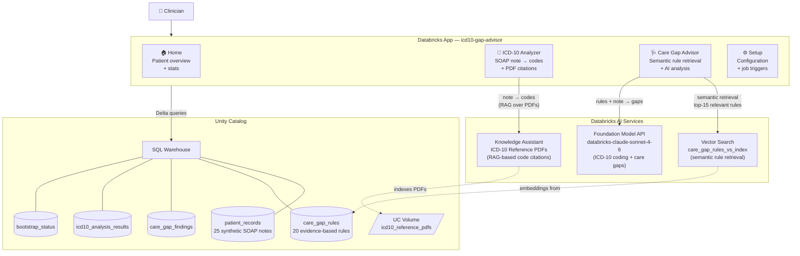
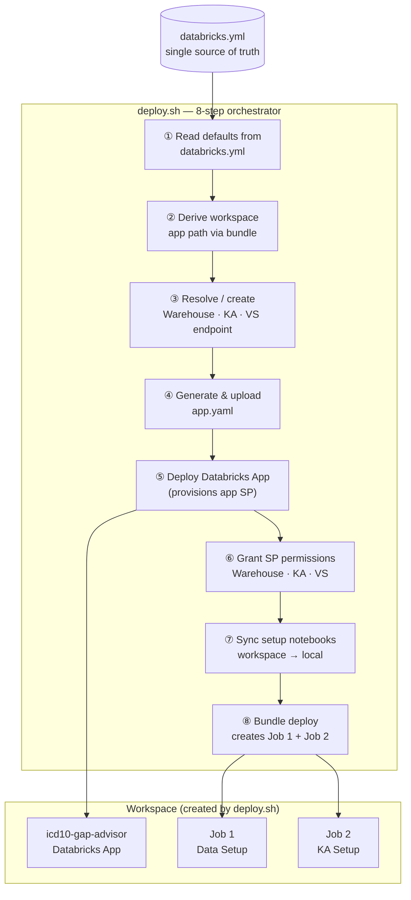
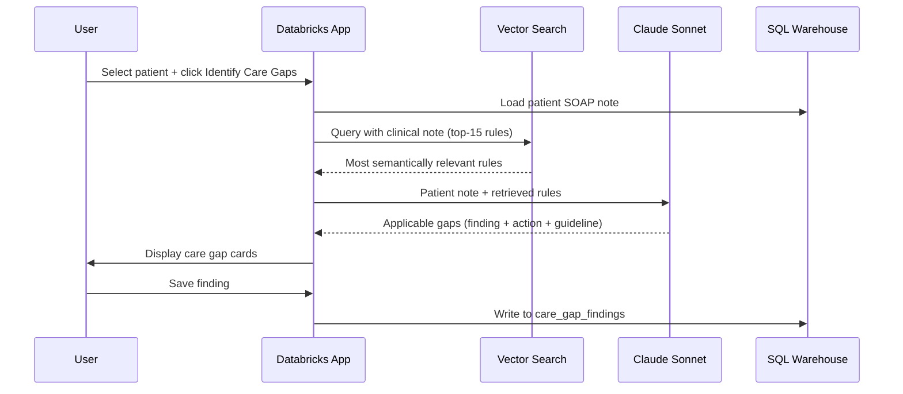

# ICD-10 Gap Analysis Demo

A Databricks App that performs ICD-10 clinical coding and care gap identification on
synthetic patient records using the Databricks AI stack.

- **ICD-10 Analyzer** — loads a patient's SOAP note and returns ICD-10 code suggestions
  with PDF citations (powered by the Databricks Knowledge Assistant).
- **Care Gap Advisor** — identifies evidence-based care gaps (ADA, ACC/AHA, GOLD, NCCN,
  KDIGO) via semantic rule retrieval (Vector Search) + AI analysis (Claude Sonnet).

---

## System Architecture



---

## Deployment Architecture



---

## Prerequisites

| Requirement | Details |
|---|---|
| Databricks workspace | Unity Catalog enabled; user has `CREATE CATALOG` privilege |
| Databricks CLI | Installed and authenticated |
| Python | 3.8+ stdlib only — no additional packages required |
| Terraform | Installed locally — required by `databricks bundle deploy` |

> **SQL Warehouse, Knowledge Assistant, and Vector Search endpoint** are all resolved or
> auto-created by `setup_resources.py`. Nothing needs to be provisioned in advance.

---

## Quick Start

```bash
git clone <repo-url>
cd icd10-gapanalysis-demo

# 1. Update workspace host in databricks.yml
#    targets.dev.workspace.host: https://adb-<id>.azuredatabricks.net

# 2. Deploy — all infrastructure is auto-resolved
chmod +x deploy.sh
./deploy.sh --profile DEFAULT
```

Then open the app URL from the Databricks Apps UI and click **⚙ Setup** in the navbar to
run Job 1 (Data Setup) and Job 2 (KA Setup).

For a full walkthrough of each deployment stage and how to use each app feature, see
**[INSTALLATION.md](INSTALLATION.md)**.

---

## Configuration

All configurable values live in `databricks.yml`. `deploy.sh` reads them at startup,
resolves infrastructure, and injects final values into `app.yaml` — no manual editing needed.

| Variable | Default | Description |
|---|---|---|
| `catalog` | `my_catalog` | Unity Catalog name |
| `schema` | `icd10_care_gap` | Schema for all tables and the UC Volume |
| `warehouse_id` | `""` | SQL Warehouse ID — auto-created if empty |
| `vs_endpoint_name` | `rag_pdf_vs_endpoint` | VS endpoint for care gap rule retrieval — created if not found |
| `ka_display_name` | `ICD-10 Clinical Reference Assistant` | KA display name — looked up or created |
| `ka_endpoint_name` | `""` | Resolved automatically at deploy time |
| `ka_name` | `""` | Resolved automatically at deploy time |
| `fmapi_endpoint` | `databricks-claude-sonnet-4-6` | Foundation Model API endpoint |
| `data_setup_job_name` | `ICD-10 Gap — Data Setup` | Job 1 display name |
| `ai_setup_job_name` | `ICD-10 Gap — KA Setup` | Job 2 display name |

---

## Project Structure

```
icd10-gapanalysis-demo/
├── databricks.yml          # Bundle config — single source of truth for all variables
├── deploy.sh               # 8-step deployment orchestrator
├── setup_resources.py      # Pre-deploy: resolves SQL Warehouse + KA + VS endpoints
├── README.md
├── INSTALLATION.md         # Stage-by-stage deployment and usage guide
├── LOCAL.md                # Git-ignored personal notes (safe for local use)
├── resources/
│   └── workflows.yml       # Job 1 (Data Setup) + Job 2 (KA Setup) definitions
├── app/
│   ├── app.py              # Dash app — routing, navbar, global layout
│   ├── app.yaml            # Generated by deploy.sh — do not edit manually
│   ├── requirements.txt    # Python dependencies
│   ├── config.py           # Env vars, BOOTSTRAP_STEPS, STATUS_META constants
│   ├── db.py               # SQL helpers — patient, rules, findings CRUD
│   ├── tab_home.py         # Home tab — patient accordion + stats tiles
│   ├── tab_icd10.py        # ICD-10 Analyzer tab
│   ├── tab_caregap.py      # Care Gap Advisor tab — VS retrieval + AI analysis
│   └── tab_setup.py        # Setup page — 3-column layout, job triggers
├── setup/
│   ├── 01_create_catalog.py               # UC catalog, schema, tables, volume, grants
│   ├── 02_setup_care_gap_rules.py         # Seed care_gap_rules (20 HEDIS/ADA/ACC rules)
│   ├── 02_ingest_patient_json.py          # patient_records.json → Delta table
│   ├── 03_load_icd10_pdfs_to_volume.py    # PDFs → icd10_reference_pdfs UC Volume
│   ├── 04_configure_knowledge_source.py   # Attach UC Volume to KA, trigger PDF sync
│   ├── 05_configure_ai_gateway.py         # Optional: Anthropic AI Gateway route
│   └── 06_create_care_gap_vs_index.py     # VS index on care_gap_rules (embedding_text)
└── data/
    ├── patient_records.json               # 25 synthetic SOAP-format clinical records
    └── icd10_pdfs/                        # ICD-10 reference PDFs (loaded by Job 2)
```

---

## How ICD-10 Analysis Works

1. User selects a patient — SOAP note loads from `patient_records`
2. Clicks **Analyze ICD-10 Codes**
3. App queries the **Knowledge Assistant** (`KA_ENDPOINT_NAME`) with the clinical note.
   The KA performs RAG over the indexed ICD-10 reference PDFs, grounding suggestions
   in the official ICD-10-CM/PCS coding guidelines
4. Response is parsed into a JSON array — each entry has `code`, `type`
   (Primary/Secondary Diagnosis), `description`, and `confidence` (HIGH/MEDIUM/LOW)
5. User reviews codes and clicks **Save** — stored to `icd10_analysis_results`

> **Requires Job 2** — the ICD-10 reference PDFs must be attached and indexed in the
> Knowledge Assistant. A banner appears if indexing is still in progress.

---

## How Care Gap Analysis Works



Vector Search retrieves rules semantically — a note mentioning "HbA1c 9.2%, metformin BID"
surfaces T2DM rules without needing ICD-10 codes. This means patients with no saved ICD-10
codes get the same retrieval quality as coded patients.

**To add or update rules:** insert/update rows in `care_gap_rules` then trigger a VS sync.
No code changes or redeployment needed.

```sql
-- Add a new rule
INSERT INTO catalog.schema.care_gap_rules
VALUES ('CGR-021', 'T2DM', 'Statin Therapy', 'ADA 2024',
        'Statin prescribed for T2DM patients aged 40–75', 'HIGH');
```

---

## Notes

- `setup_resources.py` runs **before** the app is deployed. It resolves the KA by display
  name via `GET /api/2.1/knowledge-assistants` and the VS endpoint via
  `GET /api/2.0/vector-search/endpoints/{name}`. Both are created automatically if not found.
- All setup notebooks are **idempotent** — safe to re-run at any time.
- `deploy.sh` syncs setup notebooks from the workspace before running `databricks bundle deploy`,
  so the bundle always has the latest notebook versions and never deletes workspace files.
