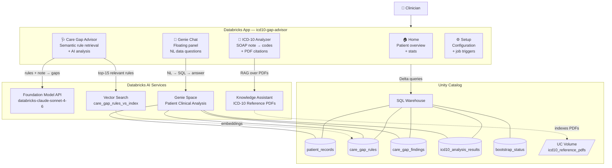
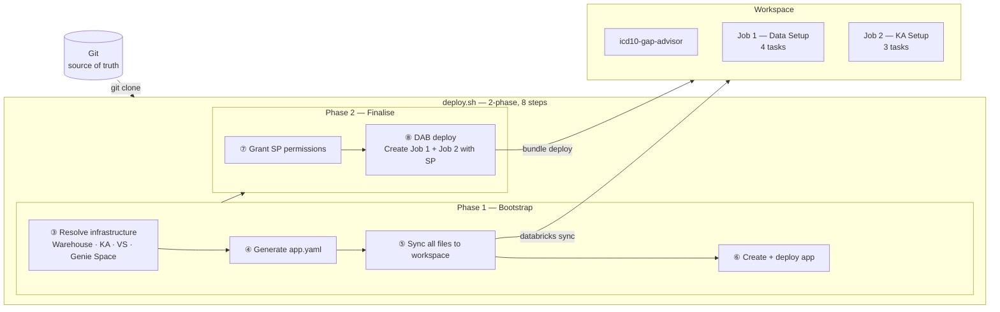
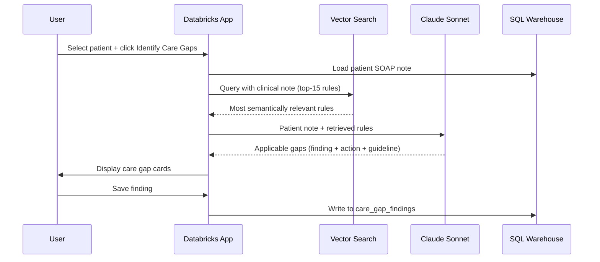

# ICD-10 Gap Analysis Demo

A Databricks App that performs ICD-10 clinical coding, care gap identification, and
natural-language patient data analytics on synthetic patient records using the full
Databricks AI stack.

- **ICD-10 Analyzer** — loads a patient's SOAP note and returns ICD-10 code suggestions
  with PDF citations (powered by the Databricks Knowledge Assistant).
- **Care Gap Advisor** — identifies evidence-based care gaps (ADA, ACC/AHA, GOLD, NCCN,
  KDIGO) via semantic rule retrieval (Vector Search) + AI analysis (Claude Sonnet).
- **Patient Data Assistant** — floating AI chat panel powered by a Genie Space. Ask
  natural-language questions about patient records, ICD-10 results and care gaps.

---

## System Architecture



---

## Deployment Architecture



---

## Prerequisites

| Requirement | Details |
|---|---|
| Databricks workspace | Unity Catalog enabled; user has `CREATE CATALOG` privilege |
| Databricks CLI | Installed and authenticated (`databricks auth login`) |
| Python | 3.8+ stdlib only — no additional packages required on local machine |
| Terraform | Installed locally — required by `databricks bundle deploy` |

> **SQL Warehouse, Knowledge Assistant, Vector Search endpoint, and Genie Space** are all
> resolved or auto-created by `setup_resources.py`. Nothing needs to be provisioned in advance.

---

## Quick Start

```bash
git clone https://github.com/kuldeep-in/icd10-gapanalysis-demo
cd icd10-gapanalysis-demo

# 1. Edit databricks.yml — set workspace.host and optionally catalog/schema
#    targets.dev.workspace.host: https://adb-<id>.azuredatabricks.net

# 2. Deploy — all infrastructure is auto-resolved
chmod +x deploy.sh
./deploy.sh --profile DEFAULT
```

Then open the app URL printed in the deployment summary and click **⚙ Setup** in the
navbar to run Job 1 (Data Setup) and Job 2 (KA Setup).

For a full walkthrough see **[INSTALLATION.md](INSTALLATION.md)**.

---

## Configuration

All configurable values live in `databricks.yml`. `deploy.sh` reads them at startup,
resolves all infrastructure, and injects final values into `app.yaml`.

| Variable | Default | Description |
|---|---|---|
| `catalog` | `my_catalog` | Unity Catalog name |
| `schema` | `icd10_care_gap` | Schema for all tables and the UC Volume |
| `warehouse_name` | `icd10-gap-demo-warehouse` | SQL Warehouse name — looked up or auto-created |
| `vs_endpoint_name` | `rag_pdf_vs_endpoint` | VS endpoint — looked up or auto-created |
| `ka_display_name` | `ICD-10 Clinical Reference Assistant` | KA display name — looked up or auto-created |
| `genie_space_name` | `icd10-gap-genie` | Genie Space title — looked up or auto-created |
| `app_name` | `icd10-gap-advisor` | Databricks App name |
| `fmapi_endpoint` | `databricks-claude-sonnet-4-6` | Foundation Model API endpoint |
| `data_setup_job_name` | `ICD-10 Gap — Data Setup` | Job 1 display name |
| `ai_setup_job_name` | `ICD-10 Gap — KA Setup` | Job 2 display name |
| `ka_endpoint_name` | `""` | Resolved automatically — never set manually |
| `ka_name` | `""` | Resolved automatically — never set manually |
| `genie_space_id` | `""` | Resolved automatically — never set manually |

---

## Project Structure

```
icd10-gapanalysis-demo/
├── databricks.yml              # Bundle config — single source of truth for all variables
├── deploy.sh                   # 2-phase, 8-step deployment orchestrator
├── setup_resources.py          # Pre-deploy: resolves Warehouse · KA · VS · Genie Space
├── README.md
├── INSTALLATION.md             # Stage-by-stage deployment and usage guide
├── resources/
│   └── workflows.yml           # Job 1 (4 tasks) + Job 2 (3 tasks) definitions
├── app/
│   ├── app.py                  # Dash app — routing, navbar, global layout, Genie panel
│   ├── app.yaml                # Generated by deploy.sh — do not edit manually
│   ├── requirements.txt        # Python dependencies
│   ├── config.py               # Env vars, BOOTSTRAP_STEPS, STATUS_META constants
│   ├── db.py                   # SQL helpers — patient, rules, findings CRUD
│   ├── tab_home.py             # Home tab — patient accordion + stats tiles
│   ├── tab_icd10.py            # ICD-10 Analyzer tab
│   ├── tab_caregap.py          # Care Gap Advisor tab — VS retrieval + AI analysis
│   ├── tab_genie.py            # Genie chat panel — floating AI assistant
│   └── tab_setup.py            # Setup page — configuration + job triggers
├── setup/
│   ├── 01_create_catalog.py                # UC catalog, schema, tables, volume, grants
│   ├── 02_setup_care_gap_rules.py          # Seed care_gap_rules (20 HEDIS/ADA/ACC rules)
│   ├── 02_ingest_patient_json.py           # patient_records.json → Delta table
│   ├── 03_load_icd10_pdfs_to_volume.py     # PDFs → icd10_reference_pdfs UC Volume
│   ├── 04_configure_knowledge_source.py    # Attach UC Volume to KA, trigger PDF sync
│   ├── 05_configure_ai_gateway.py          # Optional: Anthropic AI Gateway route
│   ├── 06_create_care_gap_vs_index.py      # VS index on care_gap_rules (embedding_text)
│   └── 07_configure_genie_space.py         # Register 4 tables to Genie Space
└── data/
    ├── patient_records.json                # 25 synthetic SOAP-format clinical records
    └── icd10_pdfs/                         # ICD-10 reference PDFs (loaded by Job 2)
```

---

## How ICD-10 Analysis Works

1. Select patient → SOAP note loads from `patient_records`
2. Click **Analyze ICD-10 Codes**
3. App queries the **Knowledge Assistant** with the clinical note — performs RAG over
   indexed ICD-10 reference PDFs, grounding suggestions in official coding guidelines
4. Response parsed into JSON array: `code`, `type`, `description`, `confidence`
5. User reviews and clicks **Save** → stored to `icd10_analysis_results`

> Requires **Job 2** — PDFs must be attached and indexed in the Knowledge Assistant.

---

## How Care Gap Analysis Works



**To add or update rules:** insert/update rows in `care_gap_rules` then trigger a VS sync —
no code changes or redeployment needed.

```sql
INSERT INTO catalog.schema.care_gap_rules
VALUES ('CGR-021', 'T2DM', 'Statin Therapy', 'ADA 2024',
        'Statin prescribed for T2DM patients aged 40–75', 'HIGH');
```

---

## How the Genie Chat Panel Works

A floating **💬** button on the left edge of the screen opens a slide-in chat panel.
Users type natural-language questions; the app sends them to the Genie Space which
generates SQL, runs it against the Delta tables, and returns a plain-English answer.

```
User: "Which patients have the most HIGH priority care gaps?"
         ↓
Genie Space (Patient Clinical Analysis)
  → Generates SQL over care_gap_findings + patient_records
  → Runs on SQL Warehouse
  → Returns: answer + optional SQL insight
         ↓
Chat panel displays the response
```

Genie has access to all 4 tables registered by Job 1 Task 5:
`patient_records`, `icd10_analysis_results`, `care_gap_findings`, `care_gap_rules`

> The chat panel shows "Setup required" until Job 1 Task 5 completes.

---

## Notes

- All setup notebooks are **idempotent** — safe to re-run at any time.
- Git is the single source of truth. `deploy.sh` syncs files from local to workspace via
  `databricks sync` — the workspace is a deployment target only.
- `app.yaml` is generated fresh on every deploy from resolved values — never commit it
  with environment-specific IDs.
- Job names in Databricks include the DAB development mode prefix:
  `[dev <username>] ICD-10 Gap — Data Setup`
